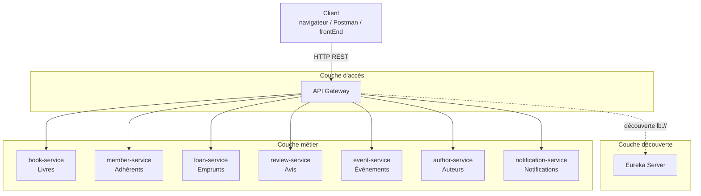
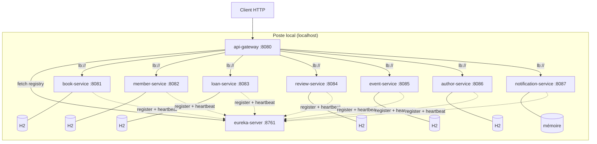

# Library Management System – Architecture microservices

🎓 Projet académique : **Applications Web Distribuées**
🧩 Monorepo : `backEnd` · `frontEnd` · `documentation`

---

## 1. Description du projet

**Library Management System** est un système de gestion de bibliothèque construit selon une **architecture microservices polyglotte** (Java / Spring Boot et Python / FastAPI).

Le système permet de gérer :

- le **catalogue de livres** et leurs **auteurs** ;
- les **adhérents** de la bibliothèque ;
- les **emprunts** et les **retours** de livres ;
- les **avis** et les notes donnés aux livres ;
- les **événements** organisés par la bibliothèque (clubs de lecture, ateliers, conférences, dédicaces) ;
- les **notifications** envoyées aux adhérents.

Chaque domaine métier est un **microservice indépendant** avec sa propre base de données. Tous s'enregistrent dans un **serveur Eureka** (découverte dynamique de services). Une **API Gateway** est le **point d'entrée unique** du backend et route chaque requête vers le bon microservice grâce à Eureka.

| Objectif pédagogique | Mise en œuvre |
|---|---|
| Découper un domaine en microservices | 7 microservices métier, un par sous-domaine |
| Service discovery | Eureka Server + clients Eureka Java et Python |
| Point d'entrée unique | Spring Cloud Gateway avec routage `lb://` |
| Architecture en couches | Controller → Service → Repository, DTO, MapStruct |
| API documentée | OpenAPI 3 / Swagger UI sur chaque service |
| Polyglottisme | 6 services Spring Boot + 1 service Python FastAPI |

---

## 2. Conception

### 2.1 Architecture logique

L'architecture logique s'organise en quatre couches :

1. **Couche d'accès** : l'**API Gateway** reçoit toutes les requêtes des clients.
2. **Couche découverte** : le **serveur Eureka** tient l'annuaire des instances disponibles.
3. **Couche métier** : sept **microservices autonomes**, chacun responsable d'un seul sous-domaine.
4. **Couche données** : une **base par service** (*database per service*). Aucune base n'est partagée.



Chaque microservice Spring Boot suit la même **architecture en couches** : `Controller` (DTO, validation) → `Service` (règles métier, transactions) → `Repository` (Spring Data JPA) → base H2, avec un `Mapper` MapStruct et un `GlobalExceptionHandler`.

➡️ Détail : [Architecture logique](documentation/diagrams/architecture/architecture-logique.md)

### 2.2 Architecture physique

Chaque microservice est un **processus indépendant** sur son propre port : une JVM par service Spring Boot, un processus Uvicorn pour le service Python. Chaque service Spring Boot embarque une **base H2 en mémoire** ; le service Python conserve ses données **en mémoire**. Au démarrage, chaque service **s'enregistre dans Eureka** puis envoie un **heartbeat toutes les 30 s**. Sans heartbeat pendant 90 s, l'instance est retirée du registre.



➡️ Détail : [Architecture physique](documentation/diagrams/architecture/architecture-physique.md)

### 2.3 Diagrammes

Tous les diagrammes se trouvent dans [`documentation/`](documentation/README.md) et sont écrits en Mermaid.

**Diagrammes de classes**
- [Diagramme de classes global (modèle du domaine)](documentation/diagrams/class/diagramme-classes-global.md)
- [book-service](documentation/diagrams/class/book-service.md) · [member-service](documentation/diagrams/class/member-service.md) · [loan-service](documentation/diagrams/class/loan-service.md) · [review-service](documentation/diagrams/class/review-service.md) · [event-service](documentation/diagrams/class/event-service.md) · [author-service](documentation/diagrams/class/author-service.md) · [notification-service](documentation/diagrams/class/notification-service.md)

**Diagrammes de séquence**
- [Enregistrement dans Eureka](documentation/diagrams/sequence/eureka-registration.md)
- [Routage par l'API Gateway](documentation/diagrams/sequence/gateway-routing.md)
- [Création d'un livre](documentation/diagrams/sequence/create-book.md)
- [Emprunt et retour d'un livre](documentation/diagrams/sequence/borrow-and-return.md)
- [Gestion des erreurs](documentation/diagrams/sequence/error-handling.md)

**Autres diagrammes**
- [Cas d'utilisation](documentation/diagrams/use-case/cas-utilisation.md)
- [Composants](documentation/diagrams/component/composants.md)

---

## 3. Microservices

| Microservice | Technologie | Port | Nom Eureka | Chemin de base | README |
|---|---|---|---|---|---|
| eureka-server | Spring Cloud Netflix Eureka | 8761 | – | dashboard `/` | [README](backEnd/microservices/eureka-server/README.md) |
| api-gateway | Spring Cloud Gateway | 8080 | API-GATEWAY | `/api/v1/**` | [README](backEnd/microservices/api-gateway/README.md) |
| book-service | Spring Boot | 8081 | BOOK-SERVICE | `/api/v1/books` | [README](backEnd/microservices/book-service/README.md) |
| member-service | Spring Boot | 8082 | MEMBER-SERVICE | `/api/v1/members` | [README](backEnd/microservices/member-service/README.md) |
| loan-service | Spring Boot | 8083 | LOAN-SERVICE | `/api/v1/loans` | [README](backEnd/microservices/loan-service/README.md) |
| review-service | Spring Boot | 8084 | REVIEW-SERVICE | `/api/v1/reviews` | [README](backEnd/microservices/review-service/README.md) |
| event-service | Spring Boot | 8085 | EVENT-SERVICE | `/api/v1/events` | [README](backEnd/microservices/event-service/README.md) |
| author-service | Spring Boot | 8086 | AUTHOR-SERVICE | `/api/v1/authors` | [README](backEnd/microservices/author-service/README.md) |
| notification-service | Python / FastAPI | 8087 | NOTIFICATION-SERVICE | `/api/v1/notifications` | [README](backEnd/microservices/notification-service/README.md) |

---

## 4. Technologies et prérequis

| Outil | Version |
|---|---|
| Java | JDK 25 |
| Spring Boot | 4.1.1 |
| Spring Cloud | 2025.1.2 (Netflix Eureka, Gateway Server WebFlux) |
| Spring Data JPA / H2 | base en mémoire, une par service |
| springdoc-openapi | 3.1.1 (Swagger UI) |
| MapStruct | 1.6.3 |
| Python | 3.10+ (FastAPI, Uvicorn, py-eureka-client, pytest) |
| Maven | inutile à installer : le Maven Wrapper (`mvnw`) est fourni dans chaque service |

---

## 5. Démarrage

Lancez chaque service dans un terminal séparé, **dans cet ordre** :

| Ordre | Service | Commande (depuis `backEnd/microservices/<service>`) |
|---|---|---|
| 1 | eureka-server | `./mvnw spring-boot:run` |
| 2 | book-service, member-service, loan-service, review-service, event-service, author-service | `./mvnw spring-boot:run` |
| 3 | notification-service | `python -m pip install -r requirements.txt` puis `python -m uvicorn app.main:app --port 8087` |
| 4 | api-gateway | `./mvnw spring-boot:run` |

Sous Windows, utilisez `mvnw.cmd spring-boot:run` dans cmd et `.\mvnw.cmd spring-boot:run` dans PowerShell.

💡 Un service peut mettre jusqu'à **30 s** avant d'apparaître dans Eureka et d'être joignable via la Gateway.

**URLs utiles**

| URL | Description |
|---|---|
| http://localhost:8761 | Dashboard Eureka (8 instances attendues) |
| http://localhost:8080/actuator/gateway/routes | Routes de la Gateway |
| http://localhost:8081/swagger-ui.html … http://localhost:8086/swagger-ui.html | Swagger UI des services Spring Boot |
| http://localhost:8087/swagger-ui | Swagger UI du service Python |

---

## 6. Exemples d'appels via la Gateway

Toutes les requêtes passent par **http://localhost:8080** :

```bash
curl http://localhost:8080/api/v1/books?genre=TECHNOLOGY
curl http://localhost:8080/api/v1/members?membershipType=STUDENT
curl http://localhost:8080/api/v1/loans?status=ONGOING
curl http://localhost:8080/api/v1/reviews?bookId=1
curl http://localhost:8080/api/v1/reviews/books/1/average
curl http://localhost:8080/api/v1/events?type=READING_CLUB
curl http://localhost:8080/api/v1/authors?nationality=british
curl http://localhost:8080/api/v1/notifications?recipient=amine@mail.com

curl -X POST http://localhost:8080/api/v1/loans \
  -H "Content-Type: application/json" \
  -d '{"bookId": 6, "memberId": 4, "loanDate": "2026-10-07", "dueDate": "2026-10-21"}'

curl -X PATCH http://localhost:8080/api/v1/loans/1/return
```

---

## 7. Structure du dépôt

```
.
├── README.md
├── backEnd/
│   └── microservices/
│       ├── eureka-server/          Service discovery (:8761)
│       ├── api-gateway/            Point d'entrée unique (:8080)
│       ├── book-service/            Livres (:8081)
│       ├── member-service/         Adhérents (:8082)
│       ├── loan-service/           Emprunts (:8083)
│       ├── review-service/         Avis (:8084)
│       ├── event-service/          Événements (:8085)
│       ├── author-service/         Auteurs (:8086)
│       └── notification-service/   Notifications, Python (:8087)
├── frontEnd/                       (à venir)
└── documentation/
    ├── README.md                   Index de la documentation
    └── diagrams/
        ├── architecture/           Architecture logique et physique
        ├── class/                  Diagrammes de classes
        ├── sequence/               Diagrammes de séquence
        ├── use-case/               Cas d'utilisation
        └── component/              Composants
```

## Tests

```bash
./mvnw test
python -m pytest
```

La première commande s'exécute dans chaque service Spring Boot, la seconde dans `notification-service` (après `python -m pip install -r requirements-dev.txt`).
