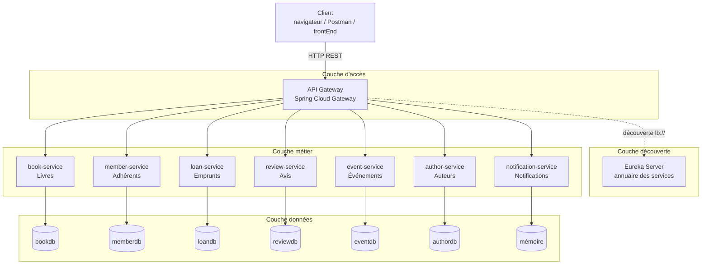
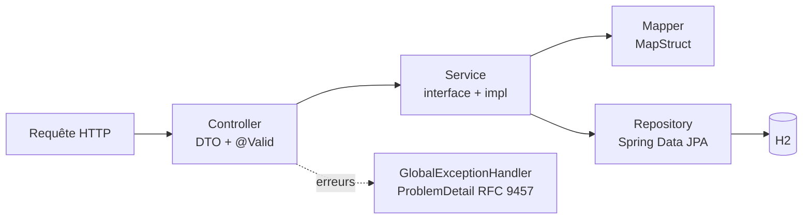

# Architecture logique

L'architecture logique décrit **l'organisation fonctionnelle** du système, indépendamment des machines qui l'exécutent.

- Le **client** (navigateur, Postman, futur frontEnd) ne connaît qu'une seule adresse : l'**API Gateway**.
- La Gateway interroge l'**annuaire Eureka** pour trouver une instance disponible du microservice cible, puis lui transmet la requête.
- Chaque **microservice métier** est autonome : il possède son propre modèle et ses propres données (*database per service*).
- **Aucun appel entre microservices** : les références entre domaines (`bookId`, `memberId`) sont de simples identifiants.

## Architecture interne d'un microservice Spring Boot

Les six microservices Spring Boot suivent la même architecture en couches :

| Couche | Responsabilité |
|---|---|
| Controller | Mapping HTTP, validation des entrées, codes de statut |
| Service | Règles métier, transactions, conversion DTO ⇄ entité |
| Repository | Accès aux données (CRUD, requêtes JPQL) |
| Mapper | Conversion DTO ⇄ entité générée à la compilation |
| Exception handler | Réponses d'erreur normalisées 400 / 404 / 409 |
