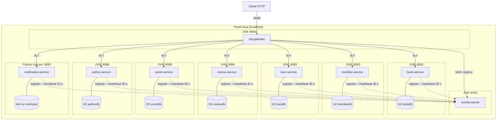

# Architecture physique

L'architecture physique décrit **le déploiement** : quels processus tournent, sur quels ports, et où sont stockées les données.

- Chaque microservice est un **processus indépendant** (une JVM par service Spring Boot, un processus Uvicorn pour Python).
- Chaque service Spring Boot embarque sa **propre base H2 en mémoire** ; le service Python garde ses données **en mémoire**.
- Au démarrage, chaque service **s'enregistre** dans Eureka puis envoie un **heartbeat toutes les 30 s**.
- La Gateway récupère le registre Eureka et **répartit la charge** entre les instances (`lb://`).

## Ports et noms

| Composant | Technologie | Port | Nom Eureka | Stockage |
|---|---|---|---|---|
| api-gateway | Spring Cloud Gateway | 8080 | API-GATEWAY | – |
| eureka-server | Spring Cloud Netflix Eureka | 8761 | – | registre en mémoire |
| book-service | Spring Boot | 8081 | BOOK-SERVICE | H2 `bookdb` |
| member-service | Spring Boot | 8082 | MEMBER-SERVICE | H2 `memberdb` |
| loan-service | Spring Boot | 8083 | LOAN-SERVICE | H2 `loandb` |
| review-service | Spring Boot | 8084 | REVIEW-SERVICE | H2 `reviewdb` |
| event-service | Spring Boot | 8085 | EVENT-SERVICE | H2 `eventdb` |
| author-service | Spring Boot | 8086 | AUTHOR-SERVICE | H2 `authordb` |
| notification-service | Python / FastAPI | 8087 | NOTIFICATION-SERVICE | mémoire |
