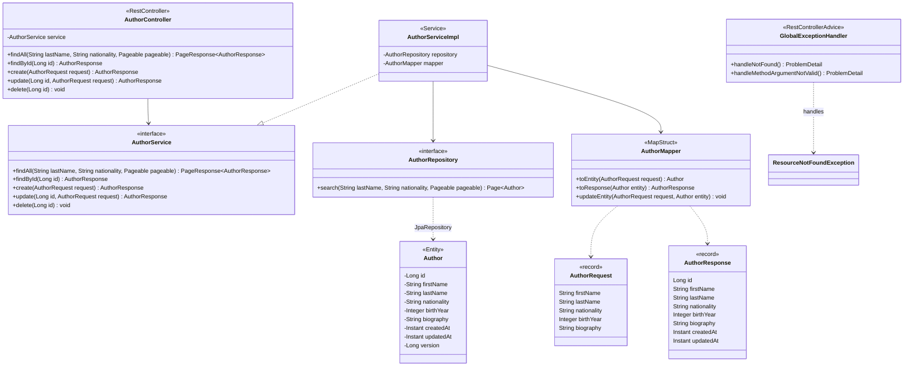

# Diagramme de classes : author-service

Classes du microservice de gestion des auteurs, de la couche HTTP à la couche persistance.

Filtres insensibles à la casse sur le nom et la nationalité.

```mermaid
classDiagram
    direction TB
    class AuthorController {
        <<RestController>>
        -AuthorService service
        +findAll(String lastName, String nationality, Pageable pageable) PageResponse~AuthorResponse~
        +findById(Long id) AuthorResponse
        +create(AuthorRequest request) AuthorResponse
        +update(Long id, AuthorRequest request) AuthorResponse
        +delete(Long id) void
    }
    class AuthorService {
        <<interface>>
        +findAll(String lastName, String nationality, Pageable pageable) PageResponse~AuthorResponse~
        +findById(Long id) AuthorResponse
        +create(AuthorRequest request) AuthorResponse
        +update(Long id, AuthorRequest request) AuthorResponse
        +delete(Long id) void
    }
    class AuthorServiceImpl {
        <<Service>>
        -AuthorRepository repository
        -AuthorMapper mapper
    }
    class AuthorRepository {
        <<interface>>
        +search(String lastName, String nationality, Pageable pageable) Page~Author~
    }
    class AuthorMapper {
        <<MapStruct>>
        +toEntity(AuthorRequest request) Author
        +toResponse(Author entity) AuthorResponse
        +updateEntity(AuthorRequest request, Author entity) void
    }
    class Author {
        <<Entity>>
        -Long id
        -String firstName
        -String lastName
        -String nationality
        -Integer birthYear
        -String biography
        -Instant createdAt
        -Instant updatedAt
        -Long version
    }
    class AuthorRequest {
        <<record>>
        String firstName
        String lastName
        String nationality
        Integer birthYear
        String biography
    }
    class AuthorResponse {
        <<record>>
        Long id
        String firstName
        String lastName
        String nationality
        Integer birthYear
        String biography
        Instant createdAt
        Instant updatedAt
    }
    class GlobalExceptionHandler {
        <<RestControllerAdvice>>
        +handleNotFound() ProblemDetail
        +handleMethodArgumentNotValid() ProblemDetail
    }
    class ResourceNotFoundException

    AuthorController --> AuthorService
    AuthorServiceImpl ..|> AuthorService
    AuthorServiceImpl --> AuthorRepository
    AuthorServiceImpl --> AuthorMapper
    AuthorRepository ..> Author : JpaRepository
    AuthorMapper ..> AuthorRequest
    AuthorMapper ..> AuthorResponse
    GlobalExceptionHandler ..> ResourceNotFoundException : handles
```
