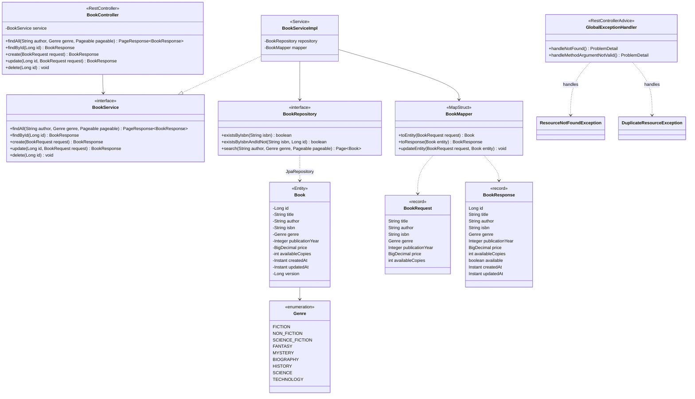

# Diagramme de classes : book-service

Classes du microservice de gestion des livres, de la couche HTTP à la couche persistance.

Règle métier : l'ISBN est unique (409 sinon).

```mermaid
classDiagram
    direction TB
    class BookController {
        <<RestController>>
        -BookService service
        +findAll(String author, Genre genre, Pageable pageable) PageResponse~BookResponse~
        +findById(Long id) BookResponse
        +create(BookRequest request) BookResponse
        +update(Long id, BookRequest request) BookResponse
        +delete(Long id) void
    }
    class BookService {
        <<interface>>
        +findAll(String author, Genre genre, Pageable pageable) PageResponse~BookResponse~
        +findById(Long id) BookResponse
        +create(BookRequest request) BookResponse
        +update(Long id, BookRequest request) BookResponse
        +delete(Long id) void
    }
    class BookServiceImpl {
        <<Service>>
        -BookRepository repository
        -BookMapper mapper
    }
    class BookRepository {
        <<interface>>
        +existsByIsbn(String isbn) boolean
        +existsByIsbnAndIdNot(String isbn, Long id) boolean
        +search(String author, Genre genre, Pageable pageable) Page~Book~
    }
    class BookMapper {
        <<MapStruct>>
        +toEntity(BookRequest request) Book
        +toResponse(Book entity) BookResponse
        +updateEntity(BookRequest request, Book entity) void
    }
    class Book {
        <<Entity>>
        -Long id
        -String title
        -String author
        -String isbn
        -Genre genre
        -Integer publicationYear
        -BigDecimal price
        -int availableCopies
        -Instant createdAt
        -Instant updatedAt
        -Long version
    }
    class BookRequest {
        <<record>>
        String title
        String author
        String isbn
        Genre genre
        Integer publicationYear
        BigDecimal price
        int availableCopies
    }
    class BookResponse {
        <<record>>
        Long id
        String title
        String author
        String isbn
        Genre genre
        Integer publicationYear
        BigDecimal price
        int availableCopies
        boolean available
        Instant createdAt
        Instant updatedAt
    }
    class GlobalExceptionHandler {
        <<RestControllerAdvice>>
        +handleNotFound() ProblemDetail
        +handleMethodArgumentNotValid() ProblemDetail
    }
    class Genre {
        <<enumeration>>
        FICTION
        NON_FICTION
        SCIENCE_FICTION
        FANTASY
        MYSTERY
        BIOGRAPHY
        HISTORY
        SCIENCE
        TECHNOLOGY
    }
    class ResourceNotFoundException
    class DuplicateResourceException

    BookController --> BookService
    BookServiceImpl ..|> BookService
    BookServiceImpl --> BookRepository
    BookServiceImpl --> BookMapper
    BookRepository ..> Book : JpaRepository
    BookMapper ..> BookRequest
    BookMapper ..> BookResponse
    Book --> Genre
    GlobalExceptionHandler ..> ResourceNotFoundException : handles
    GlobalExceptionHandler ..> DuplicateResourceException : handles
```
