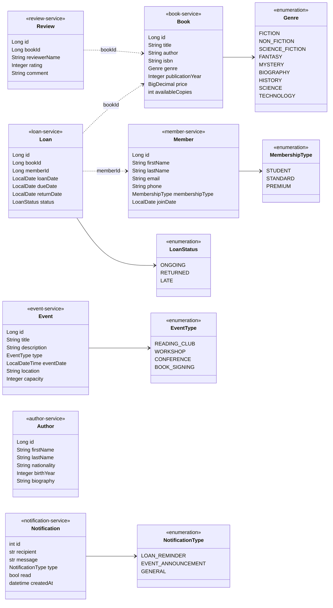

# Diagramme de classes global (modèle du domaine)

Ce diagramme regroupe les entités des sept microservices métier et leurs énumérations.

Les traits pointillés (`bookId`, `memberId`) sont des **références logiques** : il n'existe ni clé étrangère ni appel réseau entre services. Chaque service ne stocke que l'identifiant.

Toutes les entités Spring Boot possèdent aussi les champs techniques `createdAt`, `updatedAt` (audit JPA) et `version` (verrouillage optimiste). Ils sont omis ici pour la lisibilité.
