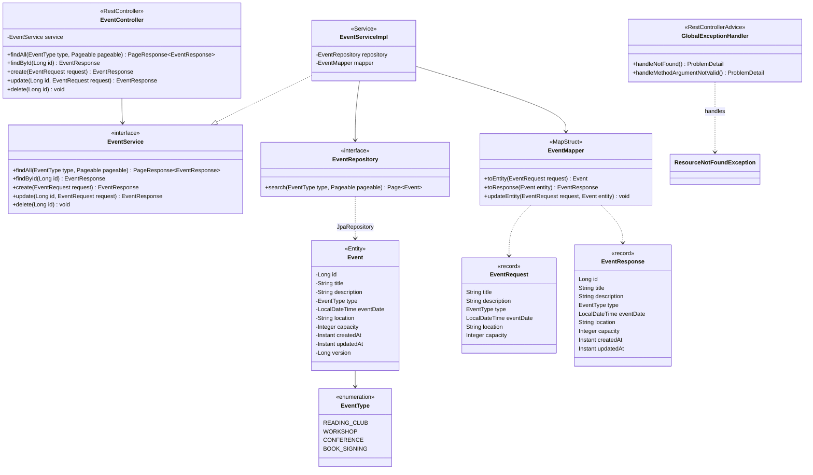

# Diagramme de classes : event-service

Classes du microservice de gestion des événements, de la couche HTTP à la couche persistance.

Règles métier : la date doit être dans le futur et la capacité strictement positive (400 sinon).

