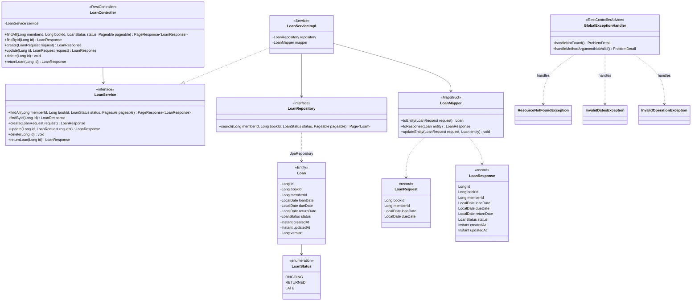

# Diagramme de classes : loan-service

Classes du microservice de gestion des emprunts, de la couche HTTP à la couche persistance.

Règles métier : `dueDate` doit être après `loanDate` (400) ; un emprunt est créé `ONGOING` ; un emprunt déjà rendu ne peut pas être rendu à nouveau (409).

