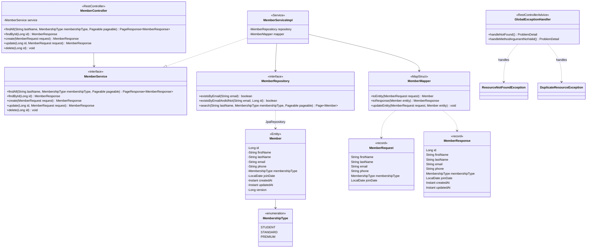

# Diagramme de classes : member-service

Classes du microservice de gestion des adhérents, de la couche HTTP à la couche persistance.

Règle métier : l'email est unique (409 sinon) ; un adhérent peut conserver son propre email lors d'une mise à jour.

