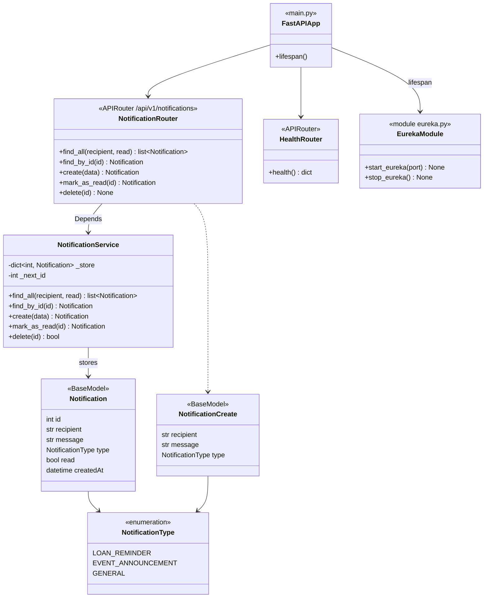

# Diagramme de classes : notification-service

Le microservice Python (FastAPI) n'a pas de base de données : les notifications sont conservées dans un dictionnaire en mémoire par `NotificationService`. Le routeur reçoit le service par injection de dépendance (`Depends(get_service)`), ce qui permet de le remplacer dans les tests.

