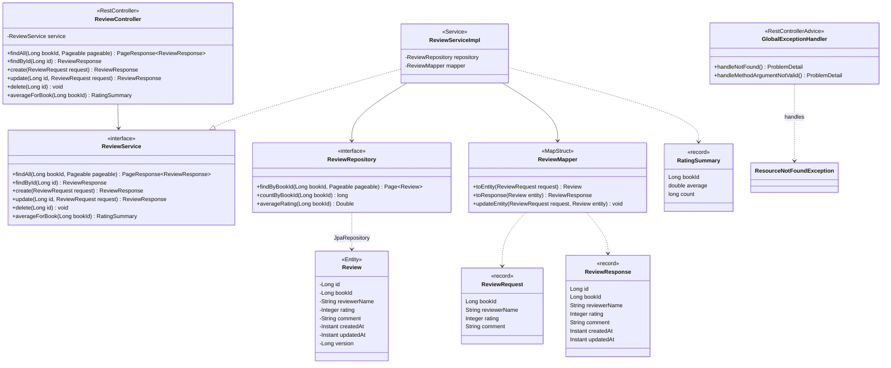

# Diagramme de classes : review-service

Classes du microservice de gestion des avis, de la couche HTTP à la couche persistance.

Règle métier : la note est comprise entre 1 et 5 ; la moyenne est arrondie à une décimale et vaut 0.0 sans avis.

