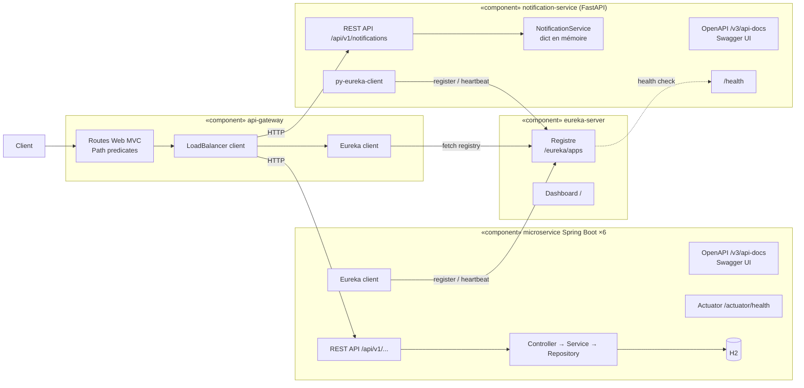

# Diagramme de composants

Vue des composants déployables et de leurs interfaces. Chaque microservice expose une API REST (`/api/v1/...`), une documentation OpenAPI et un endpoint de santé ; il consomme uniquement l'interface d'enregistrement d'Eureka.

| Composant | Interfaces fournies | Interfaces requises |
|---|---|---|
| api-gateway | `:8080/api/v1/**`, `/actuator/health` | registre Eureka, API REST des services |
| eureka-server | `/eureka/apps`, dashboard `/` | – |
| microservice Spring Boot | `/api/v1/<ressource>`, `/v3/api-docs`, `/swagger-ui.html`, `/actuator/health` | registre Eureka |
| notification-service | `/api/v1/notifications`, `/v3/api-docs`, `/swagger-ui`, `/health` | registre Eureka |
