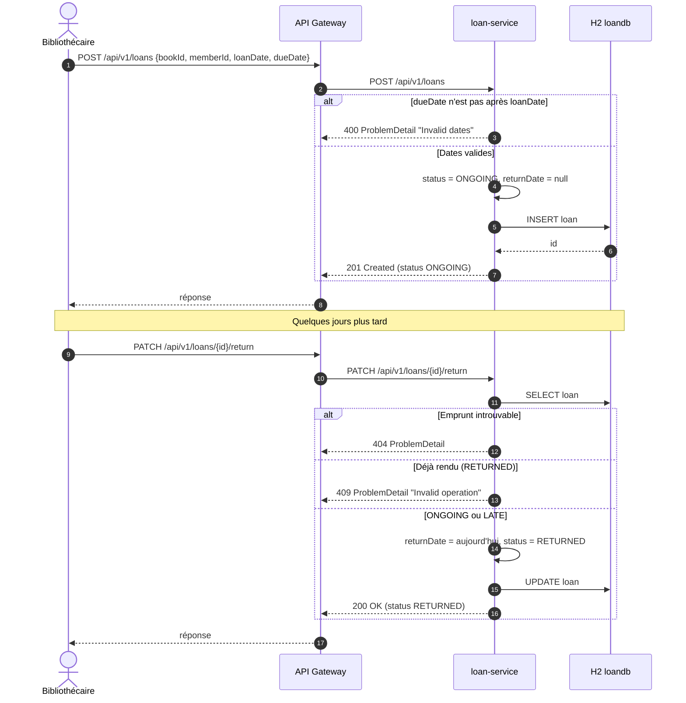

# Diagramme de séquence : emprunt puis retour d'un livre

Un adhérent emprunte un livre puis le rend. `loan-service` ne vérifie pas l'existence du livre ou de l'adhérent : il n'appelle aucun autre microservice et stocke uniquement `bookId` et `memberId`.

