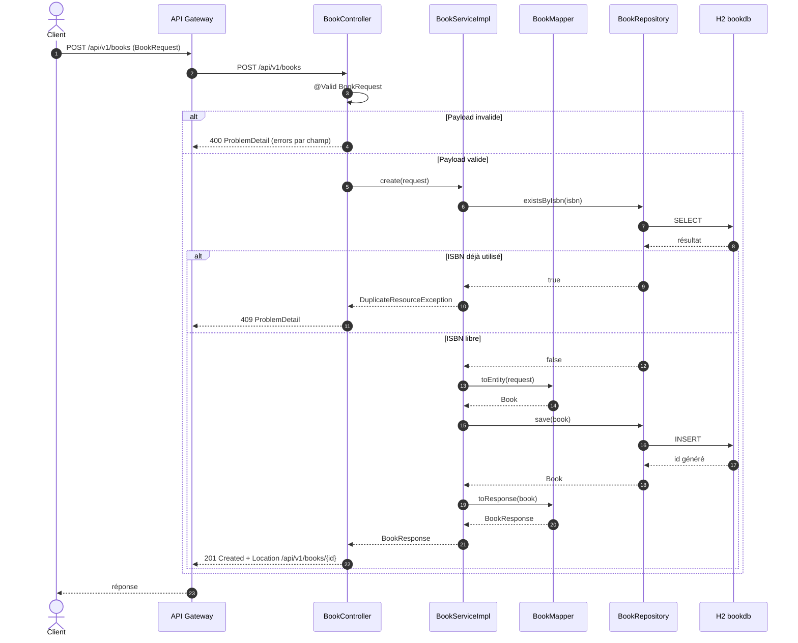

# Diagramme de séquence : création d'un livre

Parcours d'une requête de création à travers les couches de `book-service`. Le même schéma s'applique aux autres microservices Spring Boot.

```mermaid
sequenceDiagram
    autonumber
    actor C as Client
    participant GW as API Gateway
    participant CT as BookController
    participant SV as BookServiceImpl
    participant MP as BookMapper
    participant RP as BookRepository
    participant DB as H2 bookdb

    C->>GW: POST /api/v1/books (BookRequest)
    GW->>CT: POST /api/v1/books
    CT->>CT: @Valid BookRequest

    alt Payload invalide
        CT-->>GW: 400 ProblemDetail (errors par champ)
    else Payload valide
        CT->>SV: create(request)
        SV->>RP: existsByIsbn(isbn)
        RP->>DB: SELECT
        DB-->>RP: résultat
        alt ISBN déjà utilisé
            RP-->>SV: true
            SV-->>CT: DuplicateResourceException
            CT-->>GW: 409 ProblemDetail
        else ISBN libre
            RP-->>SV: false
            SV->>MP: toEntity(request)
            MP-->>SV: Book
            SV->>RP: save(book)
            RP->>DB: INSERT
            DB-->>RP: id généré
            RP-->>SV: Book
            SV->>MP: toResponse(book)
            MP-->>SV: BookResponse
            SV-->>CT: BookResponse
            CT-->>GW: 201 Created + Location /api/v1/books/{id}
        end
    end
    GW-->>C: réponse
```
