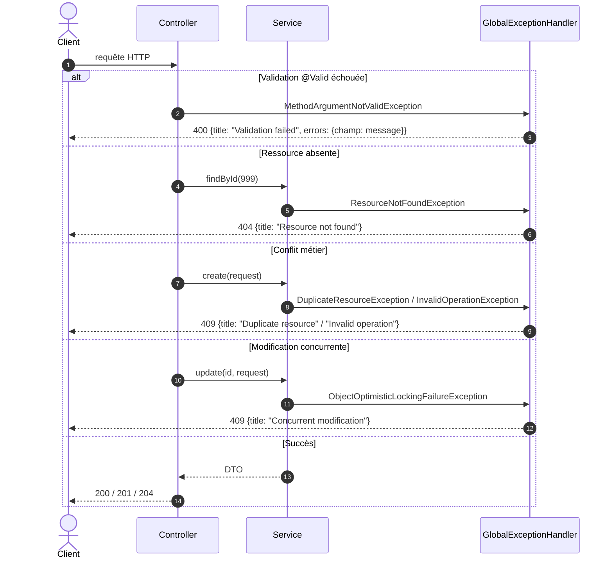

# Diagramme de séquence : gestion des erreurs

Dans chaque microservice Spring Boot, les exceptions sont interceptées par `GlobalExceptionHandler` et transformées en réponses **ProblemDetail** (RFC 9457) : `type`, `title`, `status`, `detail`, et `errors` pour les erreurs de validation.



Exemple de réponse 400 :

```json
{
  "type": "about:blank",
  "title": "Validation failed",
  "status": 400,
  "detail": "One or more fields are invalid",
  "instance": "/api/v1/members",
  "errors": { "email": "must be a well-formed email address" }
}
```

Le microservice Python renvoie le format FastAPI : `404 {"detail": "Notification 999 not found"}` et `422` pour un payload invalide.
