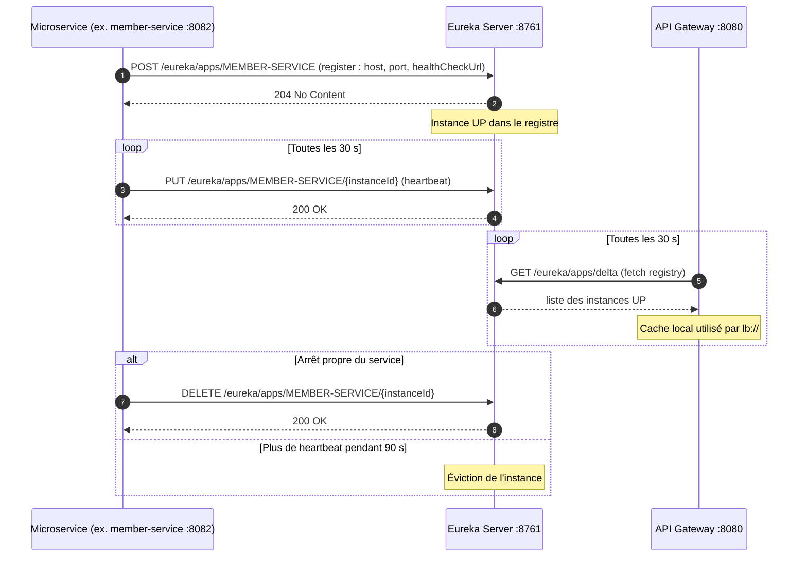

# Diagramme de séquence : enregistrement dans Eureka

Cycle de vie d'une instance dans l'annuaire Eureka : enregistrement au démarrage, renouvellement par heartbeat, récupération du registre par la Gateway, puis retrait de l'instance.

