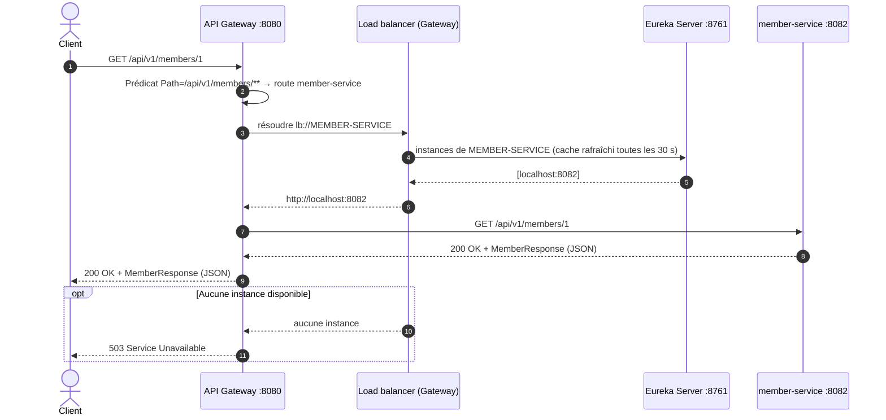

# Diagramme de séquence : routage par l'API Gateway

Le client appelle uniquement la Gateway. Celle-ci choisit la route grâce au prédicat `Path`, résout le nom logique `lb://MEMBER-SERVICE` en une adresse réelle à partir du registre Eureka, puis transmet la requête.

