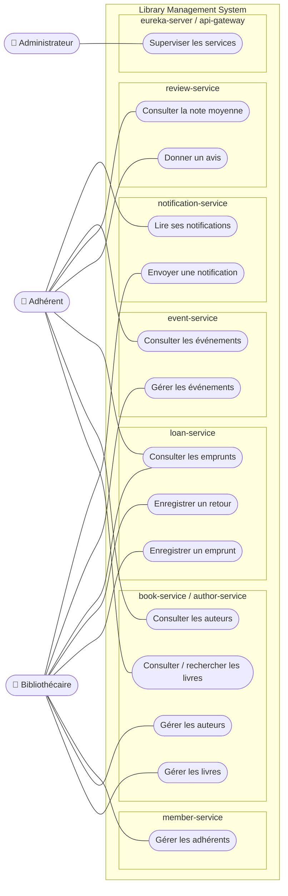

# Diagramme de cas d'utilisation

Mermaid n'a pas de type « use case » natif : le diagramme utilise un `flowchart` où les acteurs sont à gauche et les cas d'utilisation (ovales) sont regroupés par microservice.

| Acteur | Rôle |
|---|---|
| Adhérent | Consulte le catalogue, les auteurs et les événements ; donne des avis ; lit ses notifications |
| Bibliothécaire | Gère le catalogue, les auteurs, les adhérents, les emprunts, les événements ; envoie des notifications |
| Administrateur | Supervise l'infrastructure : tableau de bord Eureka, routes de la Gateway, santé des services |

